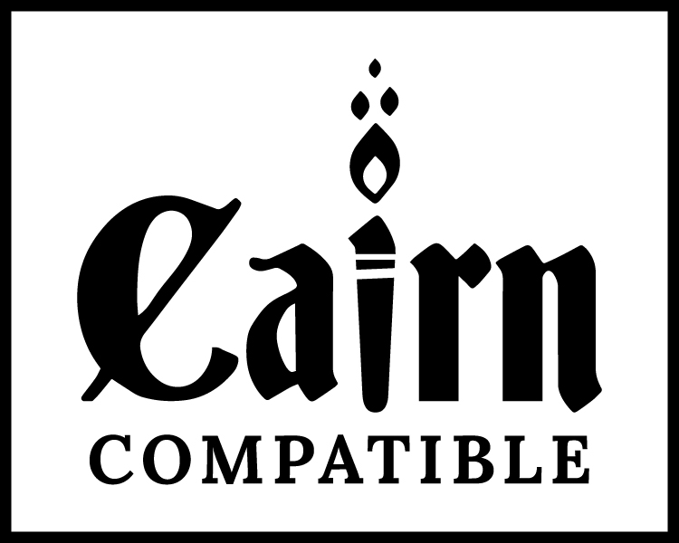

# Cairn Compatible

<p align="center">
  
</p>

**Cairn Compatible** is now available in Portuguese (Brazil) and English. The project's proposal
goes beyond translation: to build more compatibility between the different games that carry the
Cairn Compatible seal, so they all work well together on Foundry VTT.

**Cairn Compatible** já está disponível em português do Brasil e em inglês. A proposta do projeto
vai além da tradução: criar mais compatibilidade entre os diferentes jogos que usam o selo Cairn
Compatible, para que todos funcionem bem juntos no Foundry VTT.

## What's new

- Foundry VTT v13 compatibility
- Full Brazilian Portuguese localization (`en.json`/`pt-BR.json` parity)
- Toggleable automatic Scars roll (Configure Settings → Cairn)
- Coins system (Copper/Silver/Gold/Other) replacing the old Gold field
- Advantage/Normal/Disadvantage prompt for ability tests
- Impaired/Normal/Enhanced prompt for weapon damage
- "Cairn - Edição Básica (PT-BR)" compendium: items, tables, and reference journal
- More Spellbooks and More Relics content, translated with source attribution
- Alphabetized Spell Index (A-Z), in Portuguese and English

## O que há de novo

- Compatibilidade com o Foundry VTT v13
- Localização completa em português do Brasil (paridade entre `en.json`/`pt-BR.json`)
- Rolagem automática de Cicatrizes com opção de ligar/desligar (Configurar Definições → Cairn)
- Sistema de Moedas (Cobre/Prata/Ouro/Outro) no lugar do antigo campo de Ouro
- Vantagem/Normal/Desvantagem nos testes de atributo
- Prejudicado/Normal/Aprimorado no dano de arma
- Compêndio "Cairn - Edição Básica (PT-BR)": itens, tabelas e diário de referência
- Conteúdo de Mais Livros de Feitiço e Mais Relíquias, traduzido com atribuição de fonte
- Índice de Feitiços (A-Z), em português e inglês

See [`CHANGELOG-en.md`](CHANGELOG-en.md) / [`CHANGELOG-ptbr.md`](CHANGELOG-ptbr.md) for full details.

> This is a community fork of the original
> [Cairn-FoundryVTT](https://github.com/yochaigal/Cairn-FoundryVTT) by
> [Yochai Gal](https://newschoolrevolution.com). All original code remains MIT-licensed (see
> `LICENSE.txt`); Cairn text content is CC BY-SA 4.0.

Implements basic character and item sheets for playing [Cairn](https://cairnrpg.com) by [Yochai Gal](https://newschoolrevolution.com) in Foundry VTT. Cairn is a mashup of Knave and Into The Odd, meant for Wood Fantasy settings such as Necrotic Gnome's [Dolmenwood](https://necroticgnome.com/collections/dolmenwood).

The code is based on the [Electric Bastionland system](https://github.com/mvdleden/electric-bastionland-FoundryVTT/) for FoundryVTT (which in turn is based on the Into the Odd System).

## Instalação

Repositório: <https://github.com/rwelloso/cairn-compatible>

### Opção A — via manifesto (recomendada)

1. No Foundry, vá em **Configurar Sistemas de Jogo** → **Instalar Sistema**.
2. Cole no campo de manifesto:

```
https://github.com/rwelloso/cairn-compatible/releases/latest/download/system.json
```

3. Clique em **Instalar**.
4. Permita que os jogadores "criem novos Atores" no menu de permissões em **Configurar Definições**, se necessário.
5. Depois de criar um mundo com o sistema, importe a pasta de compêndio **"Cairn - Edição Básica (PT-BR)"** se quiser o conteúdo em português.

Atualizações futuras aparecem automaticamente na lista de sistemas, como qualquer outro sistema instalado dessa forma.

### Opção B — copiando a pasta manualmente

1. Baixe o `.zip` da [última release](https://github.com/rwelloso/cairn-compatible/releases/latest) (ou clone este repositório diretamente).
2. Extraia/copie o conteúdo para `[sua pasta de dados do Foundry]/Data/systems/cairn/` — a pasta precisa se chamar exatamente `cairn`.
3. Reinicie o Foundry (ou atualize a lista de sistemas).

## Installation

Repository: <https://github.com/rwelloso/cairn-compatible>

### Option A — via manifest (recommended)

1. In Foundry, go to **Game Systems** → **Install System**.
2. Paste in the manifest field:

```
https://github.com/rwelloso/cairn-compatible/releases/latest/download/system.json
```

3. Click **Install**.
4. Allow players to "Create new Actors" in the **Configure Settings** permissions menu, if needed.
5. After creating a world with the system, import the **"Cairn - Edição Básica (PT-BR)"** compendium folder if you want the Portuguese content.

Future updates show up automatically in the systems list, like any other system installed this way.

### Option B — copying the folder manually

1. Download the `.zip` from the [latest release](https://github.com/rwelloso/cairn-compatible/releases/latest) (or clone this repository directly).
2. Extract/copy the contents to `[your Foundry data folder]/Data/systems/cairn/` — the folder must be named exactly `cairn`.
3. Restart Foundry (or refresh the systems list).

## Contributing

If you want to contribute to this sheet, you'll need to clone this repository in the `systems` directory in Foundry VTT data path.

Please note that the directory needs to be named `cairn` in order to be properly detected by Foundry VTT (i.e. it needs to look like `Data\systems\cairn`).
